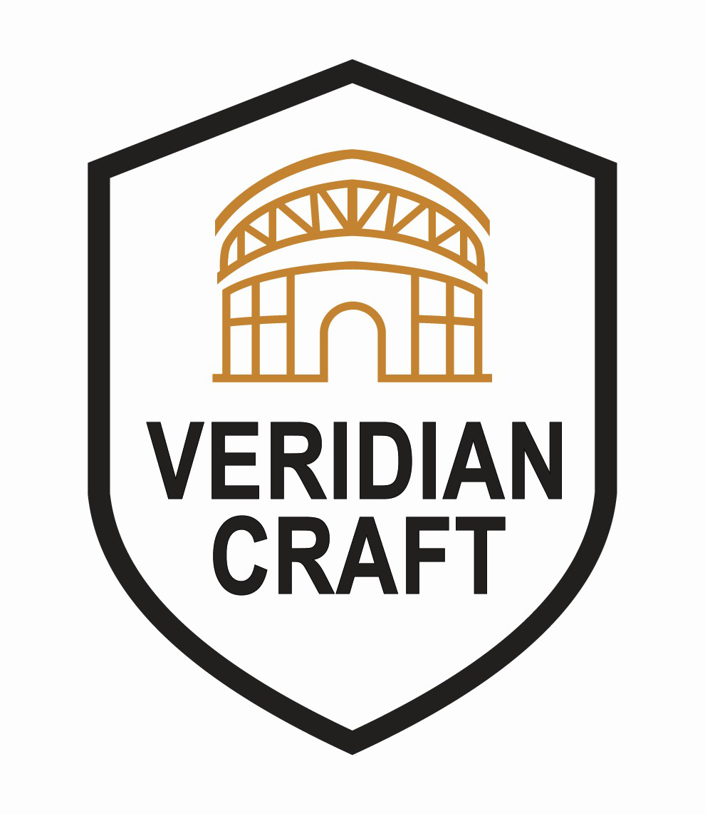

# Veridian Craft Tech Website

  
  
  <h3>INNOVATE • ENGINEER • ACHIEVE</h3>
  
  
A professional website for Veridian Craft Tech, specializing in retractable roofing and seating solutions.

  
  
  
  

---

## 🏗️ About Veridian Craft Tech

Veridian Craft Tech is a premier company specializing in innovative retractable roofing and seating solutions. We combine cutting-edge engineering, superior materials, and expert craftsmanship to create customized outdoor living and commercial spaces.

### Our Services
- **Soft Top Fabric Roofs** - Flexible retractable fabric solutions
- **Hard Top Roofs** - Durable polycarbonate roofing systems  
- **Retractable Pergolas** - Stylish adjustable shade structures
- **Tensile Structures** - Custom architectural membrane designs
- **Sports Sheds** - Robust metal roofing solutions
- **Skylight Systems** - Natural lighting enhancement solutions
- **Retractable Seating** - Space-saving flexible seating systems

---

## 🚀 Features

### ✨ Modern Design
- **Responsive Design** - Works flawlessly on all devices
- **Dark Theme** - Professional dark color palette
- **CSS Variables** - Maintainable color system
- **Smooth Animations** - Enhanced user experience

### 🎨 Professional UI/UX
- **Custom Logo Integration** - Professional shield-style branding
- **Interactive Components** - Hover effects and transitions
- **Accessibility** - WCAG compliant design
- **SEO Optimized** - Proper meta tags and structure

### 📧 Contact System
- **Functional Contact API** - Backend email processing
- **Form Validation** - Client and server-side validation
- **Professional Email Templates** - Branded email communications
- **Social Media Integration** - Multiple contact channels

### 🛠️ Technical Excellence
- **Next.js 14** - Latest App Router architecture
- **TypeScript** - Type-safe development
- **Tailwind CSS** - Utility-first styling
- **Shadcn/UI** - High-quality component library

---

## 🖥️ Screenshots

### Homepage

### Services Page

### Contact Page

---

## 🛠️ Tech Stack

| Technology | Purpose | Version |
|------------|---------|---------|
| **Next.js** | React Framework | 14.0 |
| **TypeScript** | Type Safety | 5.0 |
| **Tailwind CSS** | Styling | 3.3 |
| **Shadcn/UI** | Component Library | Latest |
| **Lucide React** | Icons | Latest |
| **Nodemailer** | Email Service | 6.9 |

---

## 🚀 Getting Started

### Prerequisites
- Node.js 18+ 
- npm or yarn
- Git

### Installation

1. **Clone the repository**
   \`\`\`bash
   git clone https://github.com/yourusername/veridian-craft-website.git
   cd veridian-craft-website
   \`\`\`

2. **Install dependencies**
   \`\`\`bash
   npm install
   # or
   yarn install
   \`\`\`

3. **Run the development server**
   \`\`\`bash
   npm run dev
   # or
   yarn dev
   \`\`\`

4. **Open your browser**
   Navigate to [http://localhost:3000](http://localhost:3000)

---

## 🎨 Color Palette

The website uses a sophisticated dark color scheme:

\`\`\`css
:root {
  --quicksand: #b69d8a;    /* Primary accent */
  --woodsmoke: #141419;    /* Background */
  --soya-bean: #62574e;    /* Secondary */
  --merlin: #3a332d;       /* Card backgrounds */
  --gunsmoke: #7c8484;     /* Text */
  --jumbo: #7c7c84;        /* Muted text */
  --cape-cod: #444c4c;     /* Borders */
  --mule-fawn: #84542e;    /* CTA buttons */
  --abbey: #44444c;        /* Subtle backgrounds */
  --outer-space: #2c3434;  /* Section backgrounds */
}
\`\`\`

---

## 🚀 Deployment

### Deploy to Vercel (Recommended)

1. **Push to GitHub**
   \`\`\`bash
   git add .
   git commit -m "Initial commit"
   git push origin main
   \`\`\`

2. **Deploy on Vercel**
   - Visit [vercel.com](https://vercel.com)
   - Import your GitHub repository
   - Add environment variables
   - Deploy!

### Alternative Deployment Options
- **Netlify**: Static site hosting
- **AWS Amplify**: Full-stack deployment
- **Railway**: Container deployment
- **DigitalOcean**: VPS deployment

---

## 🤝 Contributing

I welcome contributions! Please follow these steps:

1. Fork the repository
2. Create a feature branch (\`git checkout -b feature/amazing-feature\`)
3. Commit your changes (\`git commit -m 'Add amazing feature'\`)
4. Push to the branch (\`git push origin feature/amazing-feature\`)
5. Open a Pull Request

### Development Guidelines
- Follow TypeScript best practices
- Use Tailwind CSS for styling
- Maintain responsive design
- Test on multiple devices
- Follow accessibility standards

---

## 📝 License

This project is licensed under the MIT License - see the [LICENSE](LICENSE) file for details.

---

## 📞 Contact

**Veridian Craft Tech**
- 📧 Email: infoveridiancraft@gmail.com
- 📱 Phone: 93699 23536, 85955 52198
- 🌐 Website: [www.veridiancraft.com](https://www.veridiancraft.com)
- 📍 Address: Shop No-1, Dwarkapuri, Haibat Mau Mawaiya, Rai Bareli Road, Lucknow, UP - 226002

### Social Media
- [Facebook](https://facebook.com/veridiancraft)
- [Instagram](https://instagram.com/veridiancraft)
- [LinkedIn](https://linkedin.com/company/veridiancraft)
- [YouTube](https://youtube.com/@veridiancraft)

---

## 🙏 Acknowledgments

- **Next.js Team** - For the amazing React framework
- **Tailwind CSS** - For the utility-first CSS framework
- **Shadcn** - For the beautiful component library
- **Vercel** - For seamless deployment platform
- **Lucide** - For the comprehensive icon library

---

  
<strong>Built with ❤️ for Veridian Craft Tech</strong>

  
<em>INNOVATE • ENGINEER • ACHIEVE</em>

\`\`\`

---

## ⭐ Star History

---

**Made with Next.js 14 and TypeScript** 🚀
